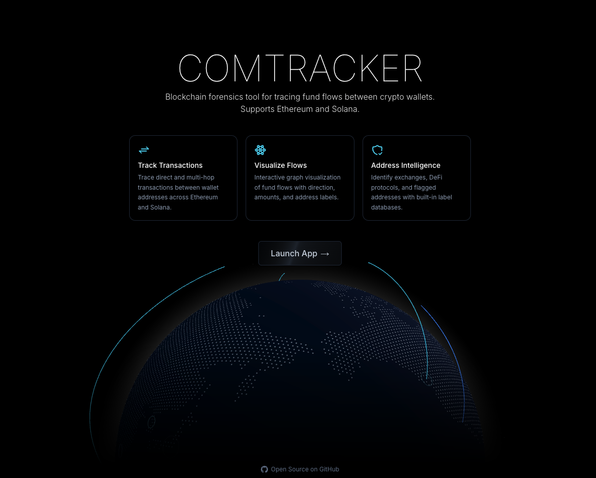
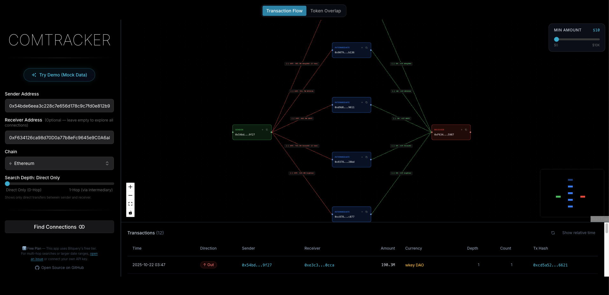
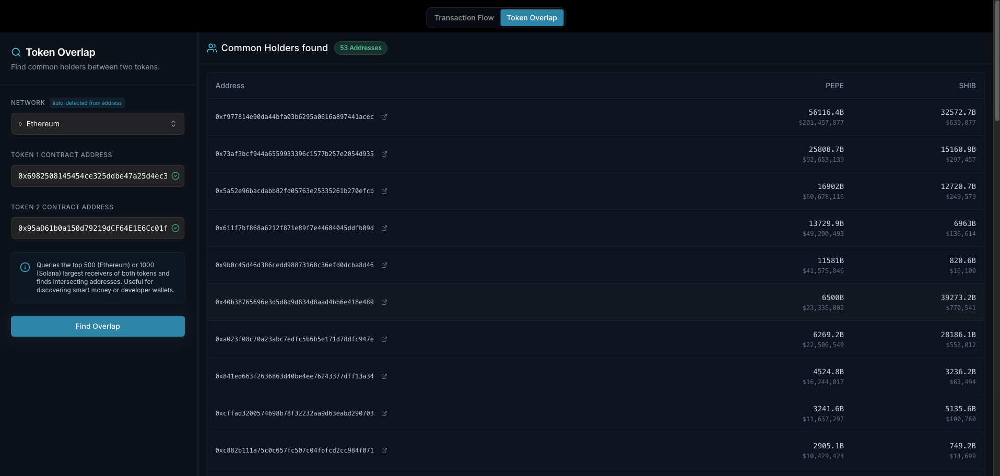

# Comtracker

> **Blockchain forensics tool** for tracing fund flows between crypto wallets across Ethereum and Solana.




---

## ✨ Features

- **Multi-Chain Transaction Tracking** — Trace direct and multi-hop transactions between wallet addresses on **Ethereum** and **Solana**.
- **Interactive Flow Visualization** — Interactive node graph (React Flow + Dagre layout) with color-coded edges for inbound/outbound transactions.




- **Node Expansion** — Click +/− on any node to explore its inbound/outbound neighbors on-demand.
- **Address Intelligence** — Built-in label databases identify exchanges, DeFi protocols, scam addresses, and known entities (scam database from [ScamSniffer](https://scamsniffer.io/), address intelligence via private scraping of [Etherscan](https://etherscan.io/), and public datasets like [dawsbot/eth-labels](https://github.com/dawsbot/eth-labels)).
- **Token Overlap Analysis** — Find common holders between two tokens with auto-chain detection from contract address format.




- **Data Table** — Sortable results table with explorer links, direction badges, and relative/absolute time toggle.
- **3D Globe Landing** — Animated Three.js globe with arc animations.
- **Secure API Proxy** — Server-side API route ensures your Bitquery API key is never exposed to the browser.

## ⚠️ Free Plan & Usage Limits

**The deployed version of Comtracker currently runs on the Bitquery Free Plan.**

Due to API constraints on the free tier:
- The app may occasionally hit simultaneous request limits (we handle this gracefully with auto-retries).
- Deep multi-hop searches or vast date ranges (especially on Solana) might be restricted by the query complexity timeouts.

### Need broader capabilities?
If the public deployment stops working due to quota exhaustion, or if you need to run heavier forensic analysis (deeper hops, wider date ranges, larger wallet networks), you have two options:
1. **Host it yourself**: Clone the repo, swap in your own [Bitquery API key](https://account.bitquery.io/user/api_v1/api_keys), and run it locally.
2. **Contact me**: Open a [GitHub Issue](https://github.com/gemdegem/comtracker/issues) to request deeper custom analysis.

---

## 🛠️ Tech Stack

| Layer | Technology |
|-------|-----------|
| Framework | Next.js 14 (App Router + Pages API) |
| Language | TypeScript |
| Styling | Tailwind CSS + Radix UI |
| Visualization | React Flow + Dagre (transaction graph) |
| 3D | Three.js + three-globe |
| Animation | Framer Motion |
| Data | Bitquery GraphQL API (V1 + V2) |
| Components | shadcn/ui (Command, Popover, Table, Dialog) |

## 🚀 Getting Started

### Prerequisites

- Node.js ≥ 18
- npm, yarn, pnpm, or bun
- [Bitquery API key](https://account.bitquery.io/user/api_v1/api_keys)

### Installation

```bash
git clone https://github.com/gemdegem/comtracker.git
cd comtracker
npm install
```

### Configuration

Create a `.env` file from the template:

```bash
cp .env.example .env
```

Add your Bitquery API key:

```
BITQUERY_API_KEY=your_key_here
```

> ⚠️ Never commit your `.env` file. The `.gitignore` already excludes it.

### Label Data (Optional)

For address intelligence, populate the `data/raw/` directory with label databases:

```
data/raw/
├── scamsniffer-all.json     # ScamSniffer phishing addresses
├── dawsbot-accounts.json    # Dawsbot/eth-labels named accounts
└── *.txt                    # Custom label files (filename = label)
```

Without these files the app works normally, but address labels won't be displayed.

### Development

```bash
npm run dev
```

Open [http://localhost:3000](http://localhost:3000) to see the application.

## 📁 Project Structure

```
comtracker/
├── app/
│   ├── layout.tsx              # Root layout with font & providers
│   ├── page.tsx                # Landing page (3D globe)
│   └── tracker/page.tsx        # Tracker dashboard
├── components/
│   ├── GlobeComponent.tsx      # Landing page globe + feature cards
│   ├── ResizableDashboard.tsx  # Main dashboard layout + state
│   ├── SearchPanel.tsx         # Search form container + progress UI
│   ├── SearchForm.tsx          # Address inputs with validation + auto-chain detect
│   ├── SearchResultsTable.tsx  # Results data table
│   ├── ChainCombobox.tsx       # Chain selector (Ethereum / Solana)
│   ├── TokenOverlapForm.tsx    # Token overlap search with auto-chain detection
│   ├── TokenOverlapTable.tsx   # Token overlap results
│   ├── ReactFlow/
│   │   ├── TransactionFlow.tsx # Graph visualization + Dagre layout
│   │   ├── CustomNode.tsx      # Custom node with expand buttons & labels
│   │   ├── GraphControls.tsx   # Min amount filter
│   │   └── ParallelEdge.tsx    # Bidirectional multi-token edge rendering
│   └── ui/                     # shadcn/ui primitives
├── hooks/
│   ├── useCoinPaths.tsx        # Main data fetching hook (cache, progressive loading)
│   └── useTokenOverlap.tsx     # Token overlap fetch hook
├── lib/
│   ├── types.ts                # TypeScript types, validators
│   ├── coinpath-queries.ts     # GraphQL query templates
│   ├── label-engine.ts         # Address label engine (ScamSniffer, Dawsbot, custom)
│   └── utils.ts                # Tailwind merge utility
├── pages/api/
│   ├── bitquery.ts             # Main API route (all backend logic)
│   └── labels.ts               # Address label lookup endpoint
├── data/
│   ├── demo-transactions.ts    # Demo data for Try Demo button
│   └── raw/                    # Label databases (gitignored)
└── styles/
    └── globals.css             # Tailwind base + CSS variables
```

## 📄 License

MIT
